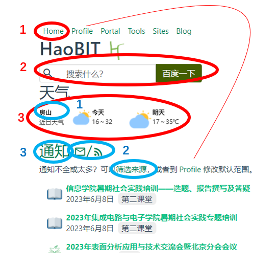
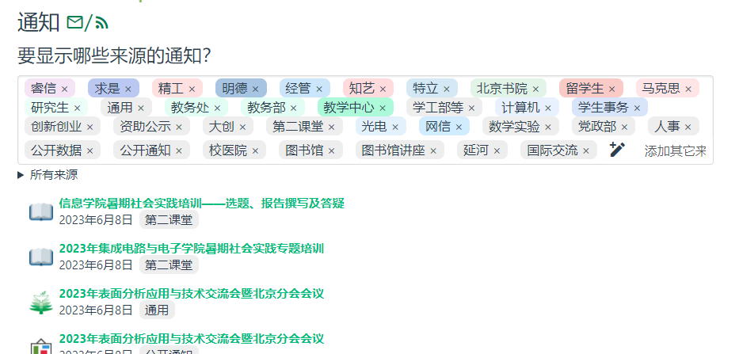
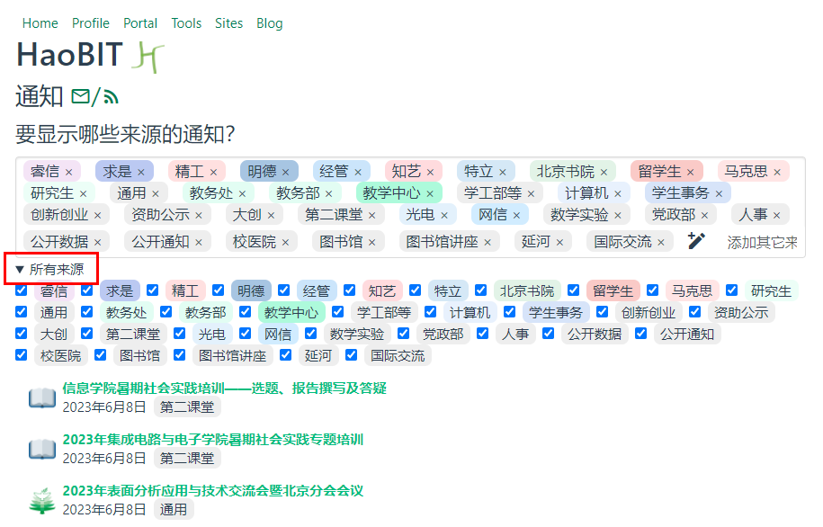
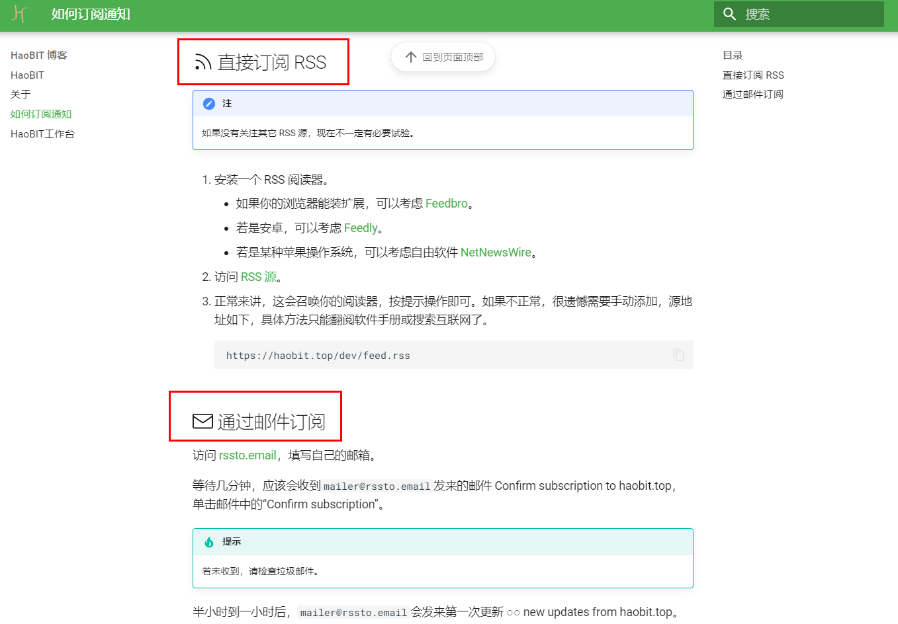
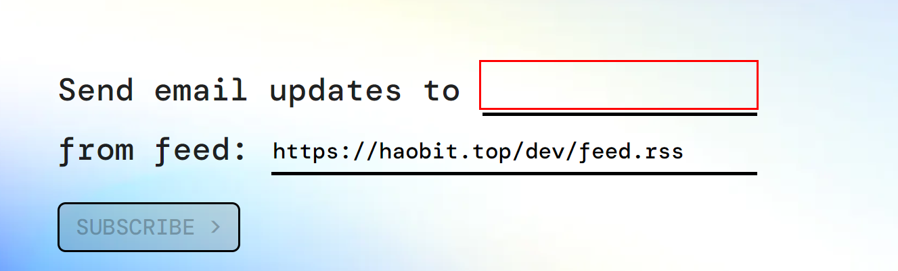
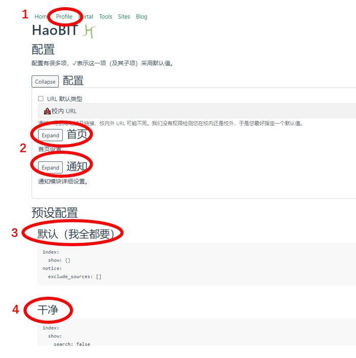
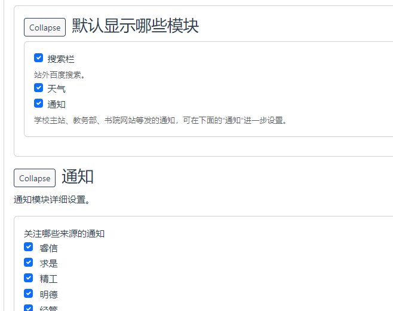
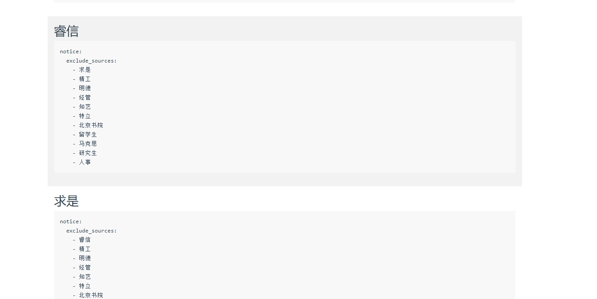
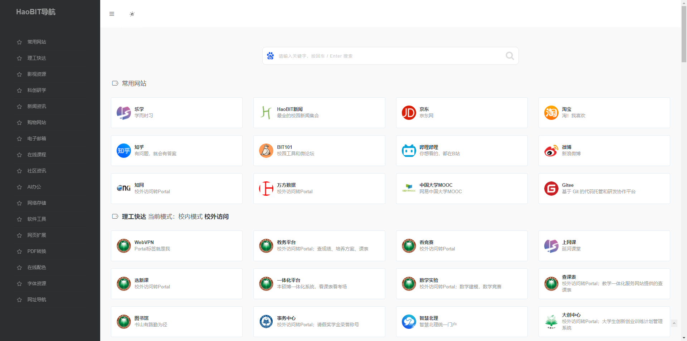

# HaoBIT

!!! tip "捧读"

    - 还在为错过学校通知而发愁吗？
    - 还在为找不到要打开学校内网页面而担忧吗？
    - 专为 BITers 设计的导航网站——[HaoBIT][haobit] 来了！

    [欢迎加入](./about.md)，同开发者一起，助力 HaoBIT 成长！

目前有如下模块。

- :material-home: **[欢迎 Home][haobit]**

  

  - 搜索框（red 2）：可直接进行百度搜索。

  - 天气（red 3）：从[天气网](https://www.tianqi.com/beijing/)获取的近日天气。

    点击位置<房山>（blue 1）可更换地理位置（关心远方的ta）

  - [通知][notice]：大大的“通知”二字，下面汇总了来自 BIT 各种网站的通知。

    （如果同学们发现有漏缺，请通过 [GitHub](https://github.com/ydX-2147483647/bulletin-issues-transferred/issues) 或 QQ 群 [757113685][qq] 联系我们！）

    单击小标题“通知”二字可[筛选来源](https://haobit.top/dev/site/notice/)，也可到“[Profile][profile] → 配置 → 通知”修改默认显示范围。

    效果是这样的，可以通过点击对应通知来源旁边的“✗”号进行删除。

    

    也可以点击“所有来源”效果如下：(注：此修改和上一条修改都是临时性的，如需长期修改，请移步profile栏)

    

    其原理是每日 8–21 时运行 [Bulletin Issues Transferred](https://github.com/YDX-2147483647/bulletin-issues-transferred/)，然后显示到这个网站。这部分采用 MIT License，同时提供 CLI、[RSS](./rss.md)、i北理 WebHook 机器人等方式。[^bulletin-issues-transferred]

    订阅服务(blue 2)：单击蓝色框内的邮箱/wifi标识即可订阅通知至邮箱，操作如下：

    

    通过邮件订阅，访问 rssto.email，在红框处填写自己的邮箱，点击SUBSCRIBE，等待邮箱收到验证信息即可。

    

- :octicons-gear-24: **[配置 Profile][profile]**

  

  单击红圈2中的Expand/Collapse即可打开/关闭设置

  

  配置 HaoBIT 网页：启用哪些模块，显示哪些来源的通知、……

  配置分层。若顶层不打勾，则内层采用默认配置；若想修改，需先打勾。

  注意“采用默认配置”与“不采用默认配置，但配置与默认相同”意义不同——我们更新默认配置时，前者会跟随变化，后者不会。

  我们为大家提供了一些预设（单击即可设置）：

  1. 默认设置（默认全选）

  2. 干净模式

  3. 针对不同书院，我们在网页下方提供了不同的预设，例如：睿信书院的同学可以单击睿信书院完成设置——效果是取消了来自其他书院的讯息推送。

  

- :material-routes: **[导航 Portal][portal]**

  在校内也能用的 [WebVPN](https://webvpn.bit.edu.cn) 镜像。

  我们抄录了 WebVPN 目录中的网站列表，记下了校内、校外两个版本的链接，可随时切换。

  抱歉因为跨域限制，我们无法检测您在校内还是在校外，还请手动切换。可在“[Profile][profile] → 配置 → URL 默认类型”修改默认在何处。

- :material-tools: **[工具 Tools][tools]**

  一些工具。有想法的朋友，可到 QQ 交流群 [757113685][qq] 联系我们。

  另请参见 [best-of-BITs (bytes)](https://github.com/YDX-2147483647/best-of-bits/)。

- :material-view-grid: **[网站 Sites][sites]**

  sites部分收集了大量的常用网站，根据最左侧的目录可以看到各种类型的网页。

  理工快达部分，提供校内/校外访问的切换。

  软件工具部分收集了团队常用的网页工具。

  其余部分留给大家探索（如有想要添加的网站，请通过交流群联系我们！）

  

- :material-book-multiple: **[博客 Blog][blog]**

  HaoBIT 相关新闻、说明书。

[^bulletin-issues-transferred]: Bulletin Issues Transferred 还可脱离本项目自主运行。Bulletin Issues Transferred 是这个系列最早的项目之一，[2021年12月6日发起](https://github.com/YDX-2147483647/bulletin-issues-transferred/commit/6119c3207bb30ad865d2863a2cdb1321b5456023)，2023年2月23日 [GitHub 仓库](https://github.com/YDX-2147483647/bulletin-issues-transferred/)获得了第一颗星，而 [Gitee 仓库](https://gitee.com/YDX-2147483647/bulletin-issues-transferred/)至今还没被人发现。

[haobit]: https://haobit.top
[profile]: https://haobit.top/dev/site/profile
[portal]: https://haobit.top/dev/site/portal
[tools]: https://haobit.top/dev/site/tools
[sites]: https://haobit.top/dev/site/sites
[blog]: https://haobit.top/dev/site/blog
[notice]: https://haobit.top/dev/site/notice/
[qq]: https://jq.qq.com/?_wv=1027&k=j13nOAhr
